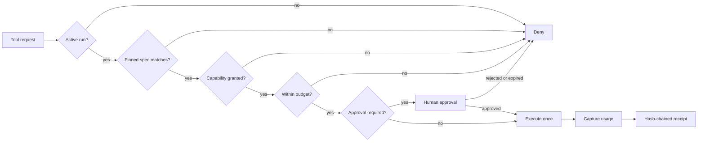

# Agent Governance Reference

[](https://github.com/Chimdi-joe/agent-governance-reference/actions/workflows/test.yml)

A compact, executable reference implementation of fail-closed controls for tool-using AI agents.

This project shows how an agent runtime can keep model-generated actions inside explicit authority, budget and review boundaries. It is newly written as a public reference and does not contain source code from any private or client system.

## Why this exists

Agent demos often focus on planning and tool access. Production systems also need to answer harder questions:

- Which tools may this run use?
- Is it still executing the specification that was approved?
- How much may it spend?
- Which actions require a person?
- What happens when a request is retried?
- Can the audit history reveal tampering?
- What is allowed to become durable memory?

This repository makes those controls visible in a small codebase that can be read and run in minutes.

## Control flow



## Implemented controls

- **Default-deny tool authorization** through capability grants scoped to named tools
- **Pinned specifications** so a run cannot silently execute a changed plan
- **Transactional-style budgets** for tool calls, tokens and cost
- **Human approval gates** that are scoped, expiring and single use
- **Idempotency receipts** that prevent duplicate side effects during retries
- **Tamper-evident audit chains** using SHA-256-linked receipts
- **Governed memory promotion** requiring automated verification and human approval
- **Expiry checks** for runs, capability grants and approvals

## Run it

Requirements: Node.js 22 or later. There are no package dependencies.

```bash
npm test
npm run demo
```

The tests cover authorization denial, specification mismatch, budget enforcement, approvals, idempotency, audit tamper detection and memory governance.

## Repository map

```text
src/kernel.ts          Governance kernel
src/types.ts           Public types and contracts
test/kernel.test.ts    Executable control tests
examples/demo.ts       Approval-to-execution walkthrough
docs/threat-model.md   Assets, boundaries, threats and limitations
SECURITY.md            Responsible reporting guidance
```

## Design choices

### The model is not the policy engine

The kernel treats plans, tool names and arguments as untrusted. Authority is supplied outside the model through a run record and explicit grants.

### Controls fail closed

Missing tools, grants, budget, matching specifications or approvals stop execution. The code does not attempt to infer permission from conversational context.

### Approval is attached to an exact action

An approval is scoped to a run, tool and idempotency key. It expires and is consumed once, limiting confused-deputy and replay risks.

### Memory is a separate trust boundary

Successful execution does not make model output safe to remember. Promotion requires verification and an explicit human decision.

## Scope and limitations

This is an educational reference, not a drop-in production authorization service. It uses in-memory storage to keep the control logic easy to inspect. Production deployments need durable transactions, authenticated identities, signed approvals, tenant isolation, secret management, policy versioning, distributed locking, observability and independent security review.

See the full [threat model](docs/threat-model.md).

## Author

Built by [Chimdinma Kalu](https://github.com/Chimdi-joe), a technical product, design and AI systems leader working across agent platforms, dependable AI products and user experience.

## License

MIT

